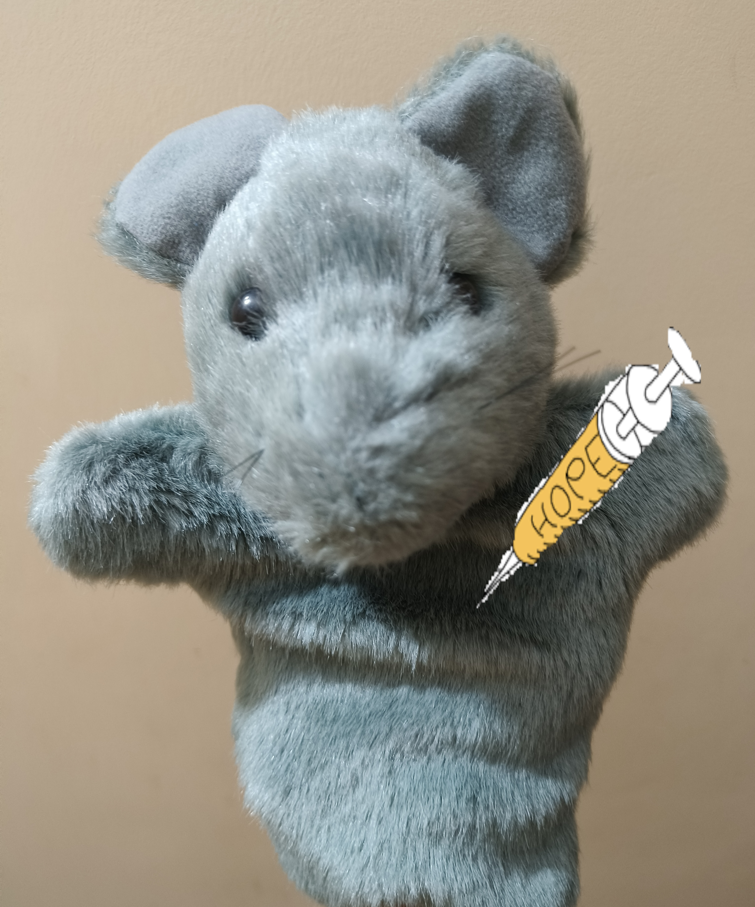

# Hi, I am Aritra 👋

I work in computational biology, with a focus on genomics, machine learning, and reproducible scientific computing.

I am currently looking for PhD positions centered around computational biology and bioinformatics.

Feel free to explore my repositories to get a better sense of the kind of work I do. 

I believe in *Do Only Good Everyday!*
As human beings, we should look out for one another and for the planet we share.
My interest in computational biology comes from a desire to better understand complex biological systems through an in-silico lens and contribute, even in a small way, to scientific progress.

Every unanswered biological question is another opportunity to better understand life and the world around us.

## Platforms & Contact
* [Email](aritra.mukherjee98@gmail.com)
* [Kaggle](https://www.kaggle.com/aridoge13)
* [Portfolio](https://aridoge13.github.io/)
* [ORCID](https://orcid.org/0000-0002-6061-611X)
* [LinkedIn](www.linkedin.com/in/aritra-mukherjee-82b070125) 